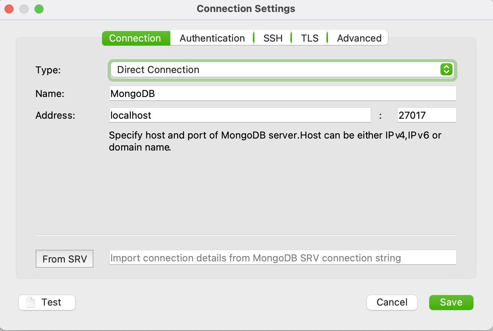
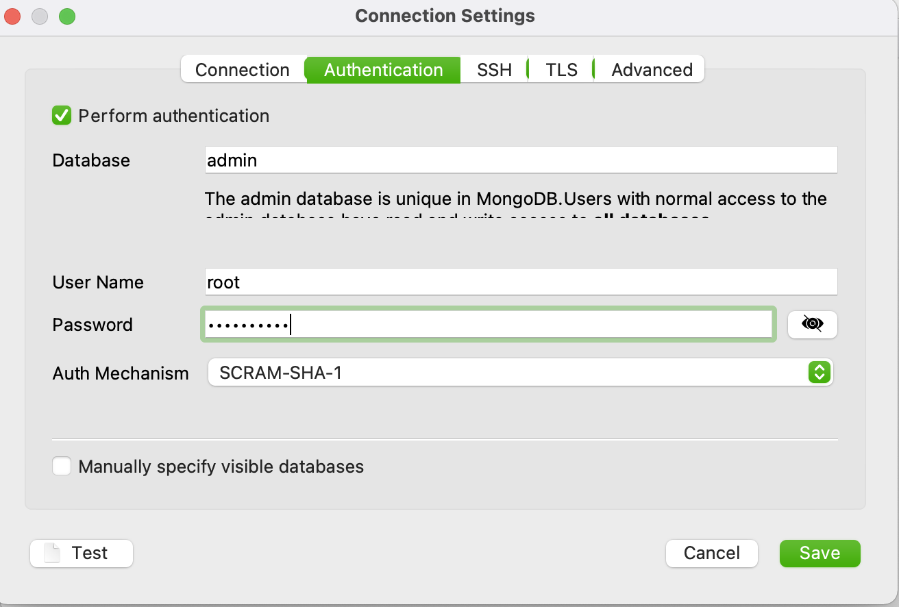

# Minikube Setup with private GIT contracts Repository

## Define Variable for Azure PersonalAccessToken and Git Repository for Spring Cloud Contracts
```
export AZURE_GIT="git://https://dev.azure.com/organisation/project/_git/contracts"
export AZURE_PAT="YOUR-PERSONAL-ACCESS-TOKEN"
```

If you already have a minikube profile with name `minikube` the following script will delete it.
for a clean installation.
```
./install.sh
```


  

# Connect to MongoDB with Robo3T
## Get Password
```
kubectl get secret --namespace default mongodb -o jsonpath="{.data.mongodb-root-password}" | base64 --decode
```
## Port Forward
```
kubectl port-forward services/mongodb-headless 27017:27017
```
## Configure MongoDB Connection



# Minikube Tips
## Minikube IP
```
minikube ip
```

## Dashboard
```
minikube dashboard  & 
```
## Get URL
```
minikube service partner-service --url
```

## Call Service
```
http $(minikube service partner-service --url)forwarded:for='minikube.me;host=minikube.me' "Authorization: Bearer $TOKEN"
```

## Minikube Ingress Setup
/etc/hosts

To get on the service with the URL `minikube.me` we update now our local `/etc/hosts` file with IP address from the minikube IP.
Run the following command:
```
echo $(minikube ip) minikube.me | sudo tee -a /etc/hosts

Password:
192.168.64.11 minikube.me
```
Verify it the IP is in the /etc/hosts with the following command:
```
cat /etc/hosts | tail -n 1

192.168.64.11 minikube.me
```

### Check Ingress
```
kubectl get ingress
Warning: extensions/v1beta1 Ingress is deprecated in v1.14+, unavailable in v1.22+; use networking.k8s.io/v1 Ingress
NAME            CLASS    HOSTS         ADDRESS        PORTS   AGE
nginx-ingress   <none>   minikube.me   192.168.64.4   80      109s
```

# Jaeger
Access Jaeger UI using:
```
minikube service jaeger-query
```

# Prometheus
```
kubectl port-forward svc/prometheus-kube-prometheus-prometheus 9090:9090
```

Access Prometheus UI via http://localhost:9090

# Grafana
```
kubectl port-forward svc/prometheus-grafana 3000:80
```

Access Grafana UI via http://localhost:3000

Credentials for Grafana are stored in secret `prometheus-grafana`

```
kubectl get secret prometheus-grafana -o yaml
```
